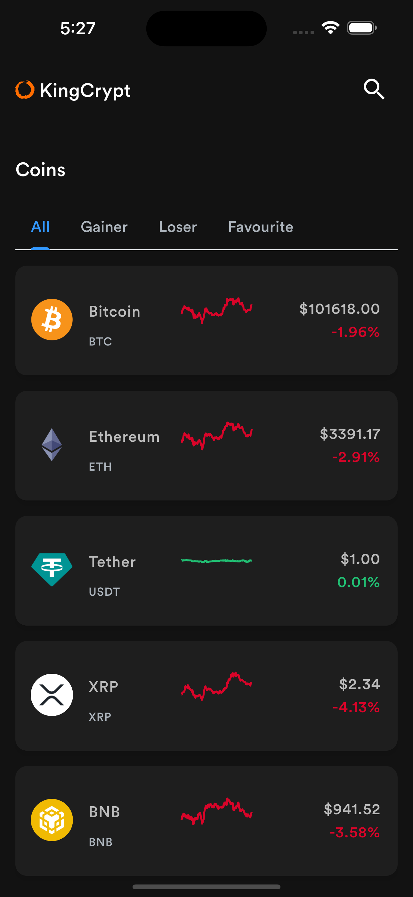
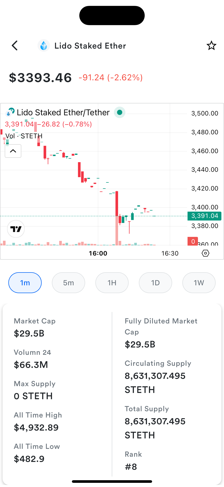
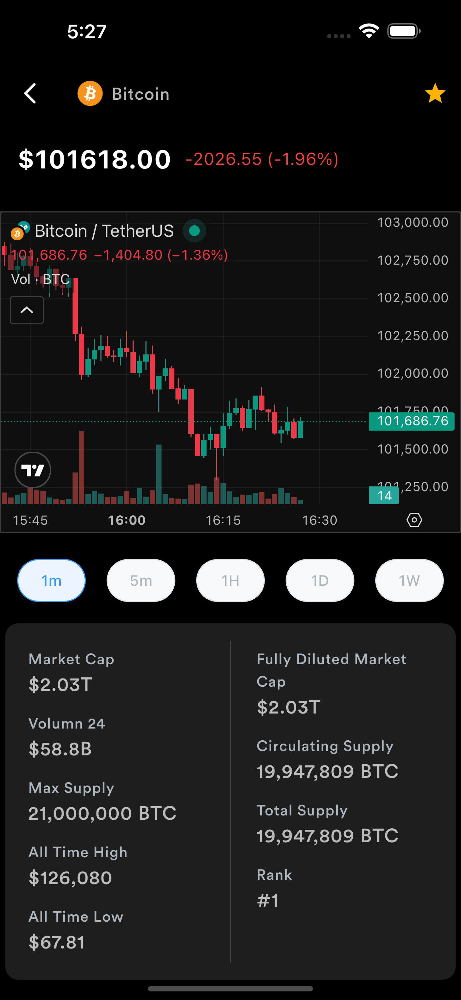
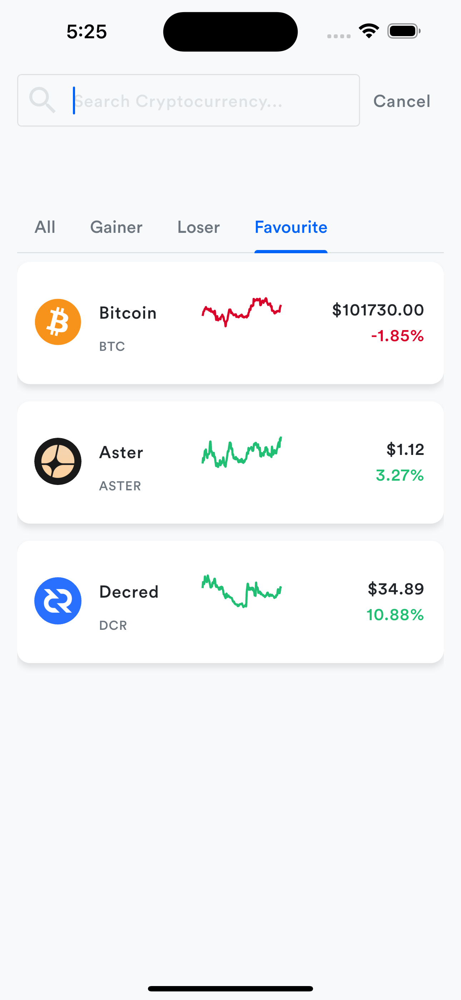

# KingCrypt - Real-Time Crypto Tracker App


**KingCrypt** is a Flutter mobile app that tracks cryptocurrency prices and market trends in real-time. Built for both Android and iOS, the app features interactive charts, live price updates, and a user-friendly interface with dark and light mode support.  

---

## Features

- 🌐 **Live Market Data**: Fetches real-time crypto data using the [CoinGecko API](https://www.coingecko.com/en/api).  
- 📈 **Interactive Charts**: TradingView charts embedded using WebView for detailed price trends.  
- ⭐ **Favourites & Search**: Mark your favourite coins and search for any coin quickly.  
- ⏱ **Auto-Refresh**: Market data auto-refreshes every 20 seconds.  
- 🌓 **Dark & Light Mode**: Follows system theme for seamless experience.  
- 📊 **Sparkline Charts**: Mini charts for quick visual representation of coin trends.  
- 💾 **Offline Caching**: Cached data ensures faster loading and offline support.  

---

## Screenshots

**Home Page & Tabs**  

  


**Coin Detail & TradingView Chart**  
  

**Search & Favourites**  
  


  

---

## Demo

- **APK Download**: [Download APK](https://drive.google.com/file/d/1S24sGK9f84_GcwwpSTCW1luo6SLmauBo/view?usp=sharing)  
- **Live Preview**: [Try on Appetize.io](https://appetize.io/app/b_gn25vqsghwewsfsvl6ta4sygea)  

---

## Installation

1. **Clone the repository:**

```bash
git clone https://github.com/PreciousGladstone/cryptoaggregator.git
cd cryptoaggregator
````

2. **Install dependencies:**

```bash
flutter pub get
```

3. **Run the app:**

```bash
flutter run
```

> ⚠️ Make sure you have a working internet connection to fetch live data from CoinGecko API.

---

## State Management

The app uses **Provider** for managing:

* Market data fetching and caching
* Search query handling
* Favourite coins tracking
* Interval selection for TradingView charts

---

## Dependencies

* [flutter](https://flutter.dev/)
* [provider](https://pub.dev/packages/provider)
* [http](https://pub.dev/packages/http)
* [webview_flutter](https://pub.dev/packages/webview_flutter)
* [fl_chart](https://pub.dev/packages/fl_chart)
* [hive](https://pub.dev/packages/hive) & [hive_flutter](https://pub.dev/packages/hive_flutter) for local storage
* [flutter_svg](https://pub.dev/packages/flutter_svg)

---

## Folder Structure

```
lib/
├── component/       # UI components (Custom AppBar, Tabs, Rows)
├── model/           # Data models (CoinData)
├── provider/        # State management
├── screens/         # All page screens
├── services/        # API services (CoinGecko)
├── util/            # Utility widgets (Custom ListTile, WebView Chart)
```

---

## Contributing

Contributions are welcome! If you want to improve KingCrypt, please fork the repo, make changes, and submit a pull request.

---

## License

This project is licensed under the MIT License. See the [LICENSE](LICENSE) file for details.

---

## References

* **GitHub Repository**: [https://github.com/PreciousGladstone/cryptoaggregator](https://github.com/PreciousGladstone/cryptoaggregator)
* **APK Download**: [https://drive.google.com/file/d/1S24sGK9f84_GcwwpSTCW1luo6SLmauBo/view?usp=sharing](https://drive.google.com/file/d/1S24sGK9f84_GcwwpSTCW1luo6SLmauBo/view?usp=sharing)
* **Appetize.io Preview**: [https://appetize.io/app/b_gn25vqsghwewsfsvl6ta4sygea](https://appetize.io/app/b_gn25vqsghwewsfsvl6ta4sygea)
* **LinkedIn Post**: [https://www.linkedin.com/posts/precious-gladstone-b710061b5_building-flutter-mobiledevelopment-activity-7394445448133906433-Coa9](https://www.linkedin.com/posts/precious-gladstone-b710061b5_building-flutter-mobiledevelopment-activity-7394445448133906433-Coa9?utm_source=social_share_send&utm_medium=member_desktop_web&rcm=ACoAADIDPwUBcBXpgdmsfhH0KOCv5dbe6MejtSk)
* **Twitter / X Post**: [https://x.com/kingmaker_sui/status/1988681905370460167?s=20](https://x.com/kingmaker_sui/status/1988681905370460167?s=20)

---


